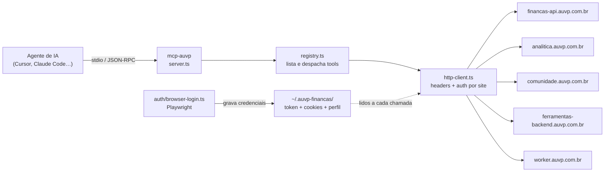
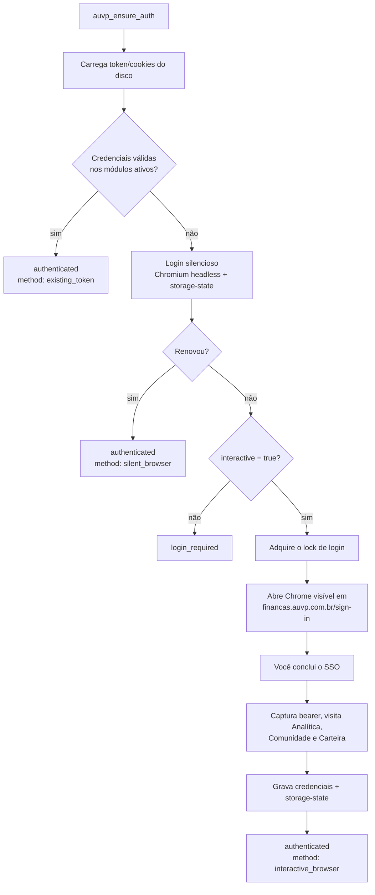

# MCP AUVP

Servidor **MCP** (Model Context Protocol) que dá ao seu agente de IA — Cursor, Claude Code, Claude Desktop, Windsurf, VS Code, etc. — acesso direto aos produtos da **AUVP**: Finanças, Analítica, Comunidade, Carteira (Diagrama do Cerrado) e Dicionário do Mercado.

Na prática: você loga uma vez no navegador e depois conversa com seus dados.

> _"Quanto gastei em mercado esse mês?"_
> _"Mostra o ranking de dividend yield das ações brasileiras."_
> _"Qual a nota dos meus ativos no Diagrama do Cerrado e onde devo aportar R$ 1.000?"_
> _"Procura na Comunidade o que falaram sobre Tesouro IPCA 2035."_

|                 |                                                                          |
| --------------- | ------------------------------------------------------------------------ |
| **Repositório** | [github.com/rod-moraes/mcp-auvp](https://github.com/rod-moraes/mcp-auvp) |
| **Transporte**  | `stdio` (roda local, na sua máquina)                                     |
| **Instalação**  | `npx github:rod-moraes/mcp-auvp` — sem clonar o repositório              |
| **Módulos**     | 5 (`financas`, `analitica`, `comunidade`, `carteira`, `dicionario`)      |
| **Tools**       | **118** (4 de autenticação + 114 de produto)                             |
| **Runtime**     | Node.js ≥ 20.18 + Playwright (Chromium) para o login                     |

---

## Sumário

- [O que é isso, em 30 segundos](#o-que-é-isso-em-30-segundos)
- [Como funciona por dentro](#como-funciona-por-dentro)
- [Os cinco módulos](#os-cinco-módulos)
- [Instalação](#instalação)
- [Autenticação — os fluxos de login](#autenticação--os-fluxos-de-login)
- [Catálogo completo de tools](#catálogo-completo-de-tools)
- [Variáveis de ambiente](#variáveis-de-ambiente)
- [Desenvolvimento](#desenvolvimento)
- [Solução de problemas](#solução-de-problemas)
- [Estrutura do repositório](#estrutura-do-repositório)

---

## O que é isso, em 30 segundos

MCP é o protocolo que permite a um LLM chamar **ferramentas** (tools) externas. Este servidor expõe as APIs dos sites da AUVP como tools, cada uma com nome, descrição e schema de parâmetros. O agente lê essa lista, escolhe a tool certa para o seu pedido em português e o MCP faz a chamada HTTP autenticada.

Três coisas que ele resolve para você:

1. **Login.** As APIs da AUVP são protegidas por SSO (Keycloak) e cookies de sessão. O MCP abre um Chrome, você loga uma vez, e ele captura e guarda bearer token, cookies e tokens de cada produto em `~/.auvp-financas/`.
2. **Renovação.** Sessão expirada é renovada em silêncio (navegador headless com o perfil salvo). O navegador visível só aparece quando não há alternativa.
3. **Contrato.** As rotas foram mapeadas a partir de HARs, bundles JS e probes ao vivo, e ficam versionadas em `catalog.ts` de cada módulo — com formatos de data, filtros aceitos e as pegadinhas conhecidas de cada endpoint.

Nada sai da sua máquina além das chamadas para os próprios sites da AUVP. Não há servidor intermediário.

---

## Como funciona por dentro



O ciclo de uma chamada:

1. O agente pede `tools/list` → o MCP devolve só as tools dos módulos habilitados.
2. O agente chama uma tool → o registry **relê token e cookies do disco** (por isso um login feito em outro chat vale imediatamente, sem reiniciar o servidor).
3. Os argumentos passam por validação Zod + JSON Schema antes de virar request.
4. O `http-client` monta os headers certos para cada site (bearer, cookie, XSRF, user-agent, origin/referer).
5. Se a resposta for **401**, o MCP tenta uma **renovação silenciosa** e repete a chamada uma vez antes de devolver erro.
6. Erros da API voltam traduzidos: mensagem de validação da API, dica de rota (ex.: _"403 — restrição de plano"_) e sugestão de chamar `auvp_ensure_auth`.

Cada módulo é uma pasta independente em `src/` com o mesmo formato: `catalog.ts` (rotas observadas), `tools.ts` (tools MCP), `scan-tools.ts` (varredura ao vivo) e um `README.md` próprio.

---

## Os cinco módulos

| Módulo         | Base da API                       | Autenticação              | Tools | Escrita? | Documentação                                         |
| -------------- | --------------------------------- | ------------------------- | :---: | :------: | ---------------------------------------------------- |
| **Finanças**   | `financas-api.auvp.com.br`        | Bearer token              |  36   |   Sim    | [src/financas/README.md](src/financas/README.md)     |
| **Analítica**  | `analitica.auvp.com.br`           | Cookie de sessão (+ XSRF) |  45   |   Não    | [src/analitica/README.md](src/analitica/README.md)   |
| **Comunidade** | `comunidade.auvp.com.br`          | Cookie IPS                |   8   |   Não    | [src/comunidade/README.md](src/comunidade/README.md) |
| **Carteira**   | `ferramentas-backend.auvp.com.br` | Bearer próprio            |  22   |   Sim    | [src/carteira/README.md](src/carteira/README.md)     |
| **Dicionário** | `worker.auvp.com.br`              | Público                   |   3   |   Não    | [src/dicionario/README.md](src/dicionario/README.md) |
| **Auth**       | —                                 | —                         |   4   |    —     | (transversal, sempre disponível)                     |

O que cada um cobre:

- **Finanças** — contas (bancárias e cartões), transações, dashboard, fluxo de caixa, orçamento, categorias, tags, faturas e conexão bancária via Pluggy.
- **Analítica** — análise fundamentalista: rankings paginados, cotações, balanço, DRE, dividendos, composição acionária, documentos, notícias, vídeos, simulador de rentabilidade, comparador e resumo de FIIs.
- **Comunidade** — fórum Invision (IPS): busca, listagem de tópicos por fórum, leitura de tópico com comentários, notificações e rankings de contribuidores.
- **Carteira** — Diagrama do Cerrado: ativos, notas, metas percentuais, cálculo de aporte, registro de compra/venda, perguntas do diagrama e mapa de ratings por país.
- **Dicionário** — Dicionário do Mercado: busca e leitura de termos, com metadados pessoais dos autores removidos da resposta.

---

## Instalação

### Pré-requisitos

- **Node.js ≥ 20.18** — [nodejs.org](https://nodejs.org/)
- Conta AUVP ativa (login em `sso.auvp.com.br`)
- Um cliente MCP com suporte a `stdio`

### Cursor

Crie ou edite `~/.cursor/mcp.json` (global) ou `.cursor/mcp.json` (só neste projeto):

```json
{
  "mcpServers": {
    "mcp-auvp": {
      "command": "npx",
      "args": ["-y", "github:rod-moraes/mcp-auvp"]
    }
  }
}
```

Depois: **Settings → MCP → Restart** (ou reinicie o Cursor). Exemplo pronto em [.cursor/mcp.json.example](.cursor/mcp.json.example).

### Claude Code

```bash
claude mcp add mcp-auvp -- npx -y github:rod-moraes/mcp-auvp
```

### Claude Desktop e outros clientes

Mesmo bloco `mcpServers` do Cursor, no `claude_desktop_config.json` (ou no arquivo de configuração MCP do seu cliente).

### Carregando só alguns módulos

Por padrão os cinco módulos sobem juntos (118 tools). Para reduzir a lista — e o consumo de contexto do agente — use `--modules`:

```json
{
  "mcpServers": {
    "mcp-auvp": {
      "command": "npx",
      "args": [
        "-y",
        "github:rod-moraes/mcp-auvp",
        "--modules",
        "financas,carteira"
      ]
    }
  }
}
```

Também funciona via `AUVP_MODULES=financas,carteira`. A flag tem precedência; ausente ou vazia, carrega todos. As **tools de autenticação continuam disponíveis em qualquer seleção**, e o `auvp_ensure_auth` passa a validar apenas os módulos escolhidos.

### Primeira execução

O `npx` baixa o repositório, roda `npm install` e compila sozinho (script `prepare`). Não é preciso clonar nem rodar `npm run build` na mão.

**Repositório privado?** Use token na URL:

```json
"args": ["-y", "git+https://TOKEN@github.com/rod-moraes/mcp-auvp.git"]
```

**Fixar versão** (em vez de seguir a `main`):

```json
"args": ["-y", "github:rod-moraes/mcp-auvp#main"]
```

### Chromium do Playwright (só se o login falhar)

Se o login reclamar da falta de navegador, rode **uma vez**:

```bash
npx -y --package=github:rod-moraes/mcp-auvp -c "playwright install chromium"
```

Com o repositório clonado: `npm run playwright:install`.

### Testando

No chat, peça ao agente:

- _"Chame `auvp_ensure_auth` para logar na AUVP."_
- _"Liste minhas contas com `auvp_financas_list_accounts`."_
- _"Confirme o status com `auvp_get_auth_status`."_

---

## Autenticação — os fluxos de login

Esta é a parte mais importante do projeto: cada produto AUVP autentica de um jeito diferente, e o MCP resolve todos em um único login.

### O que cada módulo precisa

| Módulo     | Credencial                                            | Como é capturada                                                       | Onde fica salva                      |
| ---------- | ----------------------------------------------------- | ---------------------------------------------------------------------- | ------------------------------------ |
| Finanças   | Bearer token (JWT)                                    | Cookie `accessToken` em `financas.auvp.com.br`                         | `~/.auvp-financas/access-token`      |
| Analítica  | Cookie de sessão (`kc-id-token` ou `analitica-token`) | Cookies do navegador ao visitar `analitica.auvp.com.br`                | `~/.auvp-financas/analitica-cookie`  |
| Comunidade | Cookies IPS (`ips4_member_id` + `ips4_login_key`)     | Cookies ao visitar `comunidade.auvp.com.br`                            | `~/.auvp-financas/comunidade-cookie` |
| Carteira   | Bearer próprio                                        | `localStorage["auvp-web@token"]` em `ferramentas.auvp.com.br/carteira` | `~/.auvp-financas/carteira-token`    |
| Dicionário | —                                                     | Endpoint público                                                       | —                                    |

O JWT do Finanças tem sua validade (`exp`) verificada antes do uso; expirado, dispara renovação.

### Fluxo principal — `auvp_ensure_auth`

É a única tool que você precisa chamar. Ela tenta o caminho mais barato primeiro e só escala quando necessário:



A validação não é só "existe token": o MCP faz uma chamada real por módulo ativo — `GET /users/profile` (Finanças), `/api/session` (Analítica), `/` (Comunidade), `/auth/me` (Carteira). 401/403 significa credencial morta.

Parâmetros:

| Parâmetro      | Default | Para que serve                                                                                 |
| -------------- | ------- | ---------------------------------------------------------------------------------------------- |
| `fresh`        | `false` | Apaga perfil do navegador e **todas** as credenciais antes de logar. Use para trocar de conta. |
| `forceBrowser` | `false` | Pula a checagem do token salvo e vai direto para a renovação via navegador.                    |
| `interactive`  | `true`  | Com `false`, nunca abre janela: devolve `login_required` se precisar de login.                 |

Resposta: `status` (`authenticated` \| `login_required` \| `failed`), `method` (`existing_token` \| `silent_browser` \| `interactive_browser` \| `none`), quais credenciais foram capturadas, os caminhos dos arquivos e uma `message` em português.

### Login automático ao iniciar o servidor

Quando o MCP sobe, ele já roda esse mesmo fluxo em background e loga o resultado no stderr (`[mcp-auvp] Auth authenticated (existing_token): …`). Para desativar:

```bash
AUVP_FINANCAS_AUTO_LOGIN_ON_START=0
```

Para forçar o navegador visível já no startup: `AUVP_FINANCAS_FORCE_LOGIN_ON_START=1`.

### Renovação silenciosa no meio do caminho

Se qualquer tool de produto receber **401**, o MCP tenta sozinho um login headless com o perfil salvo e **repete a chamada uma vez**. Você normalmente nem percebe. As quatro tools de auth não entram nesse retry (para não criar loop).

### Lock entre chats

Dois chats abertos não podem abrir duas janelas de login ao mesmo tempo. O primeiro cria `~/.auvp-financas/auth-login.lock`; os outros aguardam (até 10 min) e recarregam as credenciais assim que o primeiro terminar. Locks abandonados são considerados obsoletos após 15 minutos.

### Trocar de conta ou limpar a sessão

```
Chame auvp_ensure_auth com fresh: true
```

Isso apaga perfil do navegador, `storage-state.json`, bearer, cookies do Analítica e da Comunidade e o token da Carteira — e recomeça o login do zero.

### Fluxo SSO manual (alternativa)

Só use se o navegador automático não for viável. A API valida o `state` que **ela** gerou, então não monte a URL na mão:

1. `auvp_create_sso_login_url` → devolve a URL com `state` válido (aceita `state`, `scope`, `redirectUri` opcionais).
2. Abra a URL no navegador e conclua o login.
3. Se o redirect for rápido demais: DevTools → Network → **Preserve log** → filtre `callback` → copie a URL completa.
4. `auvp_complete_sso_login` com `callbackUrl` (ou `code` + `state`) **na mesma sessão do MCP**.
5. O bearer é salvo em disco automaticamente.

### O que fica no seu disco

| Arquivo                               | Conteúdo                                      |
| ------------------------------------- | --------------------------------------------- |
| `~/.auvp-financas/access-token`       | Bearer token da API Finanças (modo `0600`)    |
| `~/.auvp-financas/analitica-cookie`   | Cookie de sessão do Analítica                 |
| `~/.auvp-financas/comunidade-cookie`  | Cookies IPS da Comunidade                     |
| `~/.auvp-financas/carteira-token`     | Bearer da Carteira / Diagrama do Cerrado      |
| `~/.auvp-financas/browser-profile/`   | Perfil persistente do Playwright (sessão SSO) |
| `~/.auvp-financas/storage-state.json` | Backup de cookies para o login silencioso     |
| `~/.auvp-financas/auth-login.lock`    | Lock temporário de login                      |

**Sua senha nunca é lida nem armazenada** — quem cuida disso é o navegador, na tela do SSO. O `auvp_get_auth_status` mostra _se_ existe cada credencial, nunca o valor.

---

## Catálogo completo de tools

118 tools. Nomes completos = prefixo do módulo + nome da tabela (ex.: `list_accounts` → `auvp_financas_list_accounts`). Tools marcadas com ✏️ **escrevem** dados; 🔥 são **irreversíveis**.

Toda tool `*_list_observed_routes` devolve o catálogo local de rotas daquele módulo — útil para descobrir o que existe sem sair do chat.

### 🔐 Auth — sem prefixo de módulo (4)

| Tool                        | O que faz                                                                                     | Parâmetros                                         |
| --------------------------- | --------------------------------------------------------------------------------------------- | -------------------------------------------------- |
| `auvp_ensure_auth`          | Garante sessão válida nos módulos ativos: reusa token, renova em silêncio ou abre o navegador | `fresh`, `forceBrowser`, `interactive`             |
| `auvp_get_auth_status`      | Mostra o que está autenticado (sem revelar segredos) + metadados do projeto                   | —                                                  |
| `auvp_create_sso_login_url` | Gera a URL de login SSO com `state` válido emitido pela API                                   | `state`, `scope`, `redirectUri`                    |
| `auvp_complete_sso_login`   | Conclui o login manual e persiste o bearer                                                    | `callbackUrl` \| `code`+`state`, `followRedirects` |

### 💰 Finanças — `auvp_financas_*` (36)

**Catálogo, plano e perfil**

| Tool                   | Endpoint                | Notas                                |
| ---------------------- | ----------------------- | ------------------------------------ |
| `list_observed_routes` | —                       | Catálogo local de rotas e páginas    |
| `get_access_status`    | `GET /access/status`    | Acesso e plano do usuário            |
| `get_feature_flags`    | `GET /feature-flags/me` | Flags habilitadas                    |
| `get_profile`          | `GET /users/profile`    | Perfil do usuário logado             |
| `get_user`             | `GET /users`            | Pode dar 403 em planos sem permissão |

**Contas, bancos e faturas**

| Tool                             | Endpoint                         | Parâmetros / notas                                                                                                                                            |
| -------------------------------- | -------------------------------- | ------------------------------------------------------------------------------------------------------------------------------------------------------------- |
| `list_accounts`                  | `GET /accounts`                  | Contas + `accountsSummary` agregado                                                                                                                           |
| `list_hidden_accounts`           | `GET /accounts/hidden`           | Contas ocultas                                                                                                                                                |
| `list_account_last_transactions` | `GET /accounts/lastTransactions` | Últimas transações por conta                                                                                                                                  |
| `get_account`                    | `GET /accounts/:accountId`       | `accountId`                                                                                                                                                   |
| ✏️ `create_manual_account`       | `POST /accounts/manual`          | `name`, `type` (`BANK`\|`CREDIT`), `subtype` (`CHECKING_ACCOUNT`\|`SAVINGS_ACCOUNT`\|`CREDIT_CARD`), `number`, `balance` (número), `bankCode?`, `creditData?` |
| ✏️ `update_account`              | `PATCH /accounts/:accountId`     | `accountId`, `body`                                                                                                                                           |
| 🔥 `delete_account`              | `DELETE /accounts/:accountId`    | `accountId`                                                                                                                                                   |
| `get_account_bills`              | `GET /bills/account/:accountId`  | Faturas de cartão; 404 se a conta não for cartão                                                                                                              |
| `list_banks`                     | `GET /banks`                     | Bancos e conectores Pluggy                                                                                                                                    |
| ✏️ `create_pluggy_connect_token` | `POST /pluggy/connect-token`     | `body?` — token para conectar banco                                                                                                                           |

**Transações**

| Tool                           | Endpoint                              | Parâmetros / notas                                                                                                                           |
| ------------------------------ | ------------------------------------- | -------------------------------------------------------------------------------------------------------------------------------------------- |
| `list_transactions`            | `GET /transactions`                   | `page`, `limit`, `referenceMonth` (**YYYY-MM**), `sortBy`, `sortOrder`, `status`, `type`, `accountIds`                                       |
| `export_transactions`          | `GET /transactions/export`            | Mesmos filtros; 400 se faltar filtro obrigatório                                                                                             |
| `get_transaction`              | `GET /transactions/:transactionId`    | `transactionId`                                                                                                                              |
| ✏️ `create_manual_transaction` | `POST /transactions/manual`           | `accountId`, `amount`, `type` (`DEBIT`\|`CREDIT`), `description`, `date` (**dd-MM-yyyy HH:mm**), + `categoryId?`, `tagIds?`, `isRecurrent?`… |
| ✏️ `update_transaction`        | `PATCH /transactions/:transactionId`  | `transactionId` + `tagIds: [1,2]` ou `body` parcial                                                                                          |
| 🔥 `delete_transaction`        | `DELETE /transactions/:transactionId` | `transactionId`                                                                                                                              |

**Dashboard e orçamento**

| Tool                  | Endpoint                   | Parâmetros / notas                                     |
| --------------------- | -------------------------- | ------------------------------------------------------ |
| `get_dashboard`       | `GET /dashboard`           | `date` em **MM-YYYY**                                  |
| `get_cashflow`        | `GET /dashboard/cashflow`  | `startDate`/`endDate` em **DD/MM/YYYY** (obrigatórios) |
| `list_budgets`        | `GET /budgets`             | Metas e categorias de orçamento                        |
| `get_monthly_budget`  | `GET /budgets/monthly`     | `date` em **MM-YYYY** (obrigatório)                    |
| `get_budgets_summary` | `GET /budgets/summary`     | Pode dar 403 conforme o plano                          |
| ✏️ `create_budget`    | `POST /budgets`            | `body` no formato do frontend                          |
| ✏️ `update_budget`    | `PATCH /budgets/:budgetId` | `budgetId`, `body`                                     |

**Categorias e tags**

| Tool                  | Endpoint                         | Parâmetros / notas                                   |
| --------------------- | -------------------------------- | ---------------------------------------------------- |
| `list_categories`     | `GET /categories`                | Catálogo Pluggy                                      |
| `get_categories_tree` | `GET /categories/tree`           | Pode dar 403 conforme o plano                        |
| ✏️ `create_category`  | `POST /categories`               | `description` — uso administrativo; pode dar 403/500 |
| 🔥 `delete_category`  | `DELETE /categories/:categoryId` | `categoryId`                                         |
| `list_tags`           | `GET /tags`                      | Tags de transação                                    |
| ✏️ `create_tag`       | `POST /tags`                     | `name`, `color` (**#RRGGBB**)                        |
| ✏️ `update_tag`       | `PATCH /tags/:tagId`             | `tagId`, `body`                                      |
| 🔥 `delete_tag`       | `DELETE /tags/:tagId`            | `tagId`                                              |

### 📊 Analítica — `auvp_analitica_*` (45, somente leitura)

**Sessão, plano e conta**

| Tool                       | Endpoint                                           | Notas                                   |
| -------------------------- | -------------------------------------------------- | --------------------------------------- |
| `list_observed_routes`     | —                                                  | Catálogo local                          |
| `get_session`              | `GET /api/session`                                 | Sessão atual                            |
| `get_me`                   | `GET /api/auth/me`                                 | Usuário autenticado                     |
| `is_premium`               | `GET /api/auth/is-premium`                         | Flag de plano premium                   |
| `get_feature_flags`        | `GET /api/feature-flags/user`                      | Flags do usuário                        |
| `get_live_video_status`    | `GET /api/videos/in-live`                          | Há live acontecendo?                    |
| `get_onboard_start`        | `GET /api/onboard/start`                           | Início do onboarding                    |
| `get_onboard`              | `GET /api/onboard`                                 | `scope` (ex.: `rankings`)               |
| `list_subscriptions`       | `GET /api/subscriptions`                           | Assinaturas                             |
| `get_subscription_status`  | `GET /api/subscriptions/status`                    | Status da assinatura                    |
| `list_notifications`       | `GET /api/notifications`                           | Notificações                            |
| `get_user`                 | `GET /api/users/:userId`                           | `userId`                                |
| `get_last_answer_feedback` | `GET /api/users/:userId/meta/last-answer-feedback` | `userId`                                |
| `get_credits`              | `GET /api/credits`                                 | Créditos de visualização (assets/tools) |
| `get_pay_wall`             | `GET /api/pay-wall`                                | Páginas e limites do paywall            |

**Rankings e visualizações**

| Tool                   | Endpoint                                | Parâmetros / notas                                                                                                                             |
| ---------------------- | --------------------------------------- | ---------------------------------------------------------------------------------------------------------------------------------------------- |
| `list_views`           | `GET /api/views`                        | `limit` — ativos vistos recentemente                                                                                                           |
| `list_most_viewed`     | `GET /api/views/most-viewed`            | `companyType` (ex.: `BRA:stock`), `limit`                                                                                                      |
| `rank_codes_by_rating` | `GET /api/codes/ranked-by-rating`       | `ratingType` (`blue`/`green`/`yellow`/`red`), `limit`, `page`, `type`                                                                          |
| `get_home_ranking`     | `POST /api/bff?key=home-rankings`       | `companyType`, `country`, `rankingType` — preview de ~3 itens                                                                                  |
| `get_ranking`          | `GET /rankings/{segment}/{rankingType}` | **Ranking completo paginado.** `segment` (`acoes`\|`stocks`), `rankingType`, `page`, `limit` (≤100), `includeViabilidade`, `includeIndicators` |

`rankingType` aceita: `upside_graham`, `upside_bazin`, `dividend_yield`, `valor_mercado`, `receita_liquida`, `lucro_liquido`, `caixa`, `roe`, `margem_liquida`, `p_l`, `cagr_receita_5_anos`, `cagr_lucro_liquido_5_anos`, `altas_30_dias`, `altas_12_meses`, `roic`, `sem_prejuizo`, `divida_liquida_ebitda`, `earning_yield`.

**Ativo — fundamentos**

| Tool                   | Endpoint                                | Parâmetros / notas                                                              |
| ---------------------- | --------------------------------------- | ------------------------------------------------------------------------------- |
| `get_code`             | `GET /api/codes`                        | `code` — metadados do ativo                                                     |
| `get_quotes`           | `GET /api/quotes/:ticker`               | `ticker`, `period` (ex.: `1y`)                                                  |
| `get_balance`          | `GET /api/balance`                      | `codes`, `indicators`, `frequency`, `formatted`, `dres`, `period`, `from`, `to` |
| `get_dres`             | `GET /api/dres`                         | `asset`, `dre`, `period`, `aggregate`, `is_fund`                                |
| `get_dividends`        | `GET /api/dividends`                    | `code`, `period` (ex.: `5Y`), `aggregate`                                       |
| `get_share_holders`    | `GET /api/share-holders`                | `ticker` — composição acionária                                                 |
| `get_reviews`          | `GET /api/reviews`                      | `code`                                                                          |
| `get_documents`        | `GET /api/documents`                    | `code`, `from`, `to`, `page`, `type`                                            |
| `get_alerts`           | `GET /api/alerts`                       | `asset`                                                                         |
| `list_favorites`       | `GET /api/favorites/list`               | Favoritos do usuário                                                            |
| `get_assets_config`    | `GET /api/assets-config`                | `companyType`, `countryType`                                                    |
| `get_asset_tooltip`    | `POST /api/bff?key=asset-image-tooltip` | `code` — inclui o selo de viabilidade                                           |
| `get_credit_portfolio` | `GET /api/credit-portfolio`             | `companyId`, `report` (`indexador`\|`region`\|`pf_pj`), `period`, `aggregate`   |

**Mercado, conteúdo e simuladores**

| Tool                     | Endpoint                              | Parâmetros / notas                  |
| ------------------------ | ------------------------------------- | ----------------------------------- |
| `get_currency_quote`     | `GET /api/currency-quote`             | `currency` (default `USD`)          |
| `list_indices_quotes`    | `GET /api/index/list-with-last-quote` | Índices com última cotação          |
| `list_rates`             | `GET /api/rate/list-with-last-value`  | CDI, Selic, IPCA, IGP-M             |
| `list_news`              | `GET /api/news`                       | `asset`, `page`                     |
| `list_news_categories`   | `GET /api/news/categories`            | Categorias de notícias              |
| `list_videos`            | `GET /api/videos`                     | `asset`, `page` — análises em vídeo |
| `get_rentability`        | `GET /api/rentability/:ticker`        | `ticker`, `period` — simulador      |
| `get_rentability_config` | `GET /api/rentability/config/:ticker` | `ticker` (ex.: `min_year`)          |
| `get_fii_summary`        | `GET /api/fii-summary/:ticker`        | `ticker` — métricas do FII          |

**Comparador, templates e páginas**

| Tool                   | Endpoint                    | Parâmetros / notas                                                 |
| ---------------------- | --------------------------- | ------------------------------------------------------------------ |
| `get_codes_dres`       | `GET /api/codes/dres`       | `from`, `to`, `key` (ex.: `lucro_liquido`)                         |
| `get_column_templates` | `GET /api/column-templates` | `type` (ex.: `balance-stock`)                                      |
| `get_page_route`       | `GET {path}?_rsc=`          | `path`, `rsc?` — HTML/RSC bruto; respostas grandes, use por último |

### 💬 Comunidade — `auvp_comunidade_*` (8, somente leitura)

| Tool                   | Endpoint                     | Parâmetros / notas                                                                                                                                   |
| ---------------------- | ---------------------------- | ---------------------------------------------------------------------------------------------------------------------------------------------------- |
| `list_observed_routes` | —                            | Catálogo local de rotas IPS                                                                                                                          |
| `list_forums`          | —                            | 25 fóruns com id, slug e hierarquia (use antes de filtrar)                                                                                           |
| `search`               | `GET /search/`               | `query` (obrigatório), `forums[]`, `searchMode` (`and`\|`or`), `searchIn` (`all`\|`titles`), `contentType`, `sortBy` (`relevancy`\|`newest`), `page` |
| `list_forum_topics`    | `GET /?forumId=`             | `forum` (id ou slug), `page`                                                                                                                         |
| `get_topic`            | `GET /topic/:id-:slug/`      | `url` (URL completa ou path) — post original + comentários                                                                                           |
| `list_notifications`   | `GET /notifications/`        | Notificações do usuário                                                                                                                              |
| `get_top_contributors` | widget IPS `topContributors` | `time` (`week`\|`month`\|`year`\|`all`), `limit` (1–20)                                                                                              |
| `get_most_solved`      | widget IPS `mostSolved`      | `time`, `limit`                                                                                                                                      |

### 🌾 Carteira / Diagrama do Cerrado — `auvp_carteira_*` (22)

**Leitura**

| Tool                       | Endpoint                    | Parâmetros / notas                                                               |
| -------------------------- | --------------------------- | -------------------------------------------------------------------------------- |
| `list_observed_routes`     | —                           | Catálogo local                                                                   |
| `get_portfolio`            | `GET /auth/me`              | Ativos, metas, perguntas e preferências — **sem dados pessoais**                 |
| `list_assets`              | `GET /auth/me`              | Só a lista de ativos                                                             |
| `get_investment_goals`     | `GET /auth/me`              | Metas percentuais por classe                                                     |
| `list_questions`           | `GET /auth/me`              | Perguntas que pontuam os ativos                                                  |
| `get_classification`       | `GET /users/classification` | Classificação do perfil de investimento                                          |
| `get_config`               | `GET /config`               | Config pública, incluindo cotação do dólar                                       |
| `search_asset_suggestions` | `GET /assets/sugestions`    | `type`, `search` — ativos disponíveis para adicionar                             |
| `search_country_ratings`   | CSV do mapa                 | `query`, `limit` — países, índices, ratings (S&P/Moody's/Fitch), ETFs e empresas |

**Cálculo**

| Tool                     | Endpoint                  | Parâmetros / notas                                                                       |
| ------------------------ | ------------------------- | ---------------------------------------------------------------------------------------- |
| `calculate_contribution` | `POST /users/suggestions` | `value` — distribuição sugerida do aporte (registra o último valor calculado no serviço) |

**Escrita — ativos**

| Tool                      | Endpoint                                  | Parâmetros / notas                                                                                                  |
| ------------------------- | ----------------------------------------- | ------------------------------------------------------------------------------------------------------------------- |
| ✏️ `create_asset`         | `POST /users/assets`                      | `asset`: `type`, `name` + `alocation?`, `value?`, `amount?`, `strength?`, `useForcedStrength?`, `diagramResponses?` |
| ✏️ `update_asset`         | `PATCH /users/assets/:assetId`            | `assetId`, `changes` (ao menos um campo)                                                                            |
| 🔥 `delete_asset`         | `DELETE /users/assets/:assetId`           | `assetId`                                                                                                           |
| ✏️ `record_contribution`  | `PATCH /users/assets/:assetId/input`      | `assetId`, `value` — registra aporte                                                                                |
| ✏️ `record_sale`          | `PATCH /users/assets/:assetId/sell-input` | `assetId`, `value` — registra venda                                                                                 |
| ✏️ `update_asset_diagram` | `PATCH /users/assets/:assetId/diagram`    | `assetId`, `responses[]`, `strength`                                                                                |

`type` do ativo: `acoes_nacionais`, `acoes_internacionais`, `fundos_imobiliarios`, `reits`, `criptomoedas`, `rendafixa`, `rendafixa_internacional`.

**Escrita — metas e perguntas**

| Tool                           | Endpoint                                   | Parâmetros / notas                                                                       |
| ------------------------------ | ------------------------------------------ | ---------------------------------------------------------------------------------------- |
| ✏️ `update_investment_goals`   | `PATCH /users/:userId`                     | `goals[]` (`type` + `value`) — tipos únicos e **soma exata de 100**                      |
| ✏️ `create_question`           | `POST /wallets/diagrams`                   | `question`, `criterias`, `diagram` (`diagrama-do-cerrado`\|`investimentos-imobiliarios`) |
| ✏️ `update_question`           | `PATCH /wallets/diagrams/:questionId`      | `questionId` + os mesmos campos                                                          |
| 🔥 `delete_question`           | `DELETE /wallets/diagrams/:questionId`     | `questionId`                                                                             |
| ✏️ `apply_question_template`   | `PATCH /wallets/diagrams/autofill/:userId` | Aplica o modelo de perguntas ao usuário atual                                            |
| ✏️ `restore_default_questions` | `POST /wallets/diagrams/:userId/restore`   | Restaura as perguntas padrão                                                             |

### 📖 Dicionário do Mercado — `auvp_dicionario_*` (3, público)

| Tool                   | Endpoint                  | Parâmetros / notas                                           |
| ---------------------- | ------------------------- | ------------------------------------------------------------ |
| `list_observed_routes` | —                         | Catálogo local                                               |
| `search_terms`         | `GET /dictionary`         | `query`, `page`, `category`, `letter` (≤2), `author`         |
| `get_term`             | `GET /dictionary/:termId` | `termId` — conceito, definição, categoria, validação e datas |

As respostas passam por sanitização: e-mail, foto e demais metadados pessoais dos autores são descartados antes de chegar ao agente.

---

## Variáveis de ambiente

Todas são **opcionais** — os defaults funcionam sem configurar nada no `mcp.json`. Declare em `env` apenas se precisar de caminho customizado ou valor inline (sem arquivo em disco):

```json
"env": {
  "AUVP_MODULES": "financas,carteira",
  "AUVP_FINANCAS_ACCESS_TOKEN_FILE": "/outro/caminho/access-token"
}
```

**Seleção de módulos e login**

| Variável                             | Default                            | Descrição                                                                                |
| ------------------------------------ | ---------------------------------- | ---------------------------------------------------------------------------------------- |
| `AUVP_MODULES`                       | todos                              | `financas,analitica,comunidade,carteira,dicionario` (a flag `--modules` tem precedência) |
| `AUVP_FINANCAS_AUTO_LOGIN_ON_START`  | `1`                                | `0` desativa a verificação de auth no startup                                            |
| `AUVP_FINANCAS_FORCE_LOGIN_ON_START` | `0`                                | `1` força navegador visível no startup                                                   |
| `AUVP_AUTH_LOGIN_LOCK_FILE`          | `~/.auvp-financas/auth-login.lock` | Caminho do lock de login                                                                 |

**Credenciais (arquivo ou inline)**

| Variável                            | Default                               | Descrição                              |
| ----------------------------------- | ------------------------------------- | -------------------------------------- |
| `AUVP_FINANCAS_ACCESS_TOKEN_FILE`   | `~/.auvp-financas/access-token`       | Arquivo do bearer do Finanças          |
| `AUVP_FINANCAS_ACCESS_TOKEN`        | —                                     | Bearer inline (alternativa ao arquivo) |
| `AUVP_ANALITICA_COOKIE_FILE`        | `~/.auvp-financas/analitica-cookie`   | Cookie do Analítica                    |
| `AUVP_ANALITICA_COOKIE`             | —                                     | Cookie inline                          |
| `AUVP_COMUNIDADE_COOKIE_FILE`       | `~/.auvp-financas/comunidade-cookie`  | Cookie IPS da Comunidade               |
| `AUVP_COMUNIDADE_COOKIE`            | —                                     | Cookie inline                          |
| `AUVP_CARTEIRA_ACCESS_TOKEN_FILE`   | `~/.auvp-financas/carteira-token`     | Token da Carteira                      |
| `AUVP_CARTEIRA_ACCESS_TOKEN`        | —                                     | Token da Carteira inline               |
| `AUVP_FINANCAS_BROWSER_PROFILE_DIR` | `~/.auvp-financas/browser-profile`    | Perfil do Playwright                   |
| `AUVP_FINANCAS_STORAGE_STATE_FILE`  | `~/.auvp-financas/storage-state.json` | Backup de sessão                       |

**Endpoints e HTTP**

| Variável                      | Default                                   |
| ----------------------------- | ----------------------------------------- |
| `AUVP_FINANCAS_API_BASE_URL`  | `https://financas-api.auvp.com.br`        |
| `AUVP_FINANCAS_ORIGIN`        | `https://financas.auvp.com.br`            |
| `AUVP_ANALITICA_BASE_URL`     | `https://analitica.auvp.com.br`           |
| `AUVP_ANALITICA_ORIGIN`       | `https://analitica.auvp.com.br`           |
| `AUVP_COMUNIDADE_BASE_URL`    | `https://comunidade.auvp.com.br`          |
| `AUVP_COMUNIDADE_ORIGIN`      | `https://comunidade.auvp.com.br`          |
| `AUVP_CARTEIRA_BASE_URL`      | `https://ferramentas-backend.auvp.com.br` |
| `AUVP_CARTEIRA_ORIGIN`        | `https://ferramentas.auvp.com.br`         |
| `AUVP_DICIONARIO_BASE_URL`    | `https://worker.auvp.com.br`              |
| `AUVP_FINANCAS_TIMEOUT_MS`    | `30000`                                   |
| `AUVP_FINANCAS_EXTRA_HEADERS` | — (JSON com headers extras)               |

**SSO**

| Variável                         | Default                                               |
| -------------------------------- | ----------------------------------------------------- |
| `AUVP_FINANCAS_SSO_BASE_URL`     | `https://sso.auvp.com.br`                             |
| `AUVP_FINANCAS_SSO_REALM`        | `AUVP`                                                |
| `AUVP_FINANCAS_SSO_CLIENT_ID`    | `financas`                                            |
| `AUVP_FINANCAS_SSO_REDIRECT_URI` | `https://financas-api.auvp.com.br/auth/auvp/callback` |
| `AUVP_FINANCAS_SSO_SCOPE`        | `email profile openid`                                |

---

## Desenvolvimento

```bash
git clone https://github.com/rod-moraes/mcp-auvp.git
cd mcp-auvp
npm install                  # já dispara o build (script prepare)
npm run playwright:install   # primeira vez, para o login
npm test
```

Apontando o cliente MCP para o clone:

```json
{
  "mcpServers": {
    "mcp-auvp": {
      "command": "npx",
      "args": ["-y", "mcp-auvp"],
      "cwd": "/caminho/para/mcp-auvp"
    }
  }
}
```

Scripts:

| Comando                   | O que faz                                                                   |
| ------------------------- | --------------------------------------------------------------------------- |
| `npm run dev`             | Roda direto do TypeScript com `tsx`, sem compilar                           |
| `npm run build`           | Compila para `dist/`                                                        |
| `npm run typecheck`       | `tsc --noEmit`                                                              |
| `npm test`                | Suite Vitest (`test/`)                                                      |
| `npm run scan:financas`   | Varredura ao vivo das tools do Finanças → `data/financas-tools-report.json` |
| `npm run scan:analitica`  | Varredura do Analítica → `data/analitica-tools-report.json`                 |
| `npm run audit:analitica` | Auditoria de shape/filtros → `data/analitica-tools-audit.json`              |
| `npm run scan:comunidade` | Varredura da Comunidade → `data/comunidade-tools-report.json`               |
| `npm run scan:carteira`   | Varredura da Carteira (somente leitura)                                     |
| `npm run scan:dicionario` | Varredura do Dicionário (público)                                           |
| `npm run discover:all`    | Discovery GET/XHR dos cinco módulos (Scrapling)                             |

Os scans exigem autenticação (menos o do Dicionário) e são **somente leitura por padrão**. O ciclo de criação e remoção de dados do Finanças só roda com `AUVP_SCAN_ALLOW_WRITES=1`, usando o prefixo `MCP_SCAN` e limpando tudo ao final.

### Adicionando uma rota nova

1. Descubra a rota (ver skill [auvp-scrapling](.cursor/skills/auvp-scrapling/SKILL.md) e `scripts/discover_endpoints.py`).
2. Adicione a entrada em `src/<modulo>/catalog.ts`.
3. Crie a tool em `src/<modulo>/tools.ts` + schemas em `src/mcp/schemas/` (JSON Schema **e** Zod).
4. Inclua o probe em `src/<modulo>/scan-tools.ts` se for leitura.
5. `npm run scan:<modulo> && npm test`.

---

## Solução de problemas

| Sintoma                                     | O que fazer                                                                                                                     |
| ------------------------------------------- | ------------------------------------------------------------------------------------------------------------------------------- |
| Tool responde **401** e sugere renovar      | Chame `auvp_ensure_auth`. Se insistir, `auvp_ensure_auth` com `fresh: true`.                                                    |
| **403** em rotas do Finanças                | Restrição de plano — o erro já traz a dica. Rotas conhecidas: `/users`, `/budgets/summary`, `/categories/tree`.                 |
| **404** em `get_account_bills`              | A conta não é cartão de crédito ou não há faturas sincronizadas.                                                                |
| Login não abre / erro de navegador          | Rode `npx -y --package=github:rod-moraes/mcp-auvp -c "playwright install chromium"`.                                            |
| _"Já existe uma janela de login aberta"_    | Conclua o login na janela que já está aberta, ou feche-a e chame `auvp_ensure_auth` de novo.                                    |
| _"Outra instância está realizando o login"_ | Outro chat pegou o lock. Aguarde e chame de novo.                                                                               |
| Tools da Comunidade vazias ou falhando      | Cookie IPS ausente/expirado — `auvp_ensure_auth` e, se preciso, logue manualmente em `comunidade.auvp.com.br` na janela aberta. |
| `get_ranking` demora                        | Resposta vem via RSC do Next.js; a página 1 pode levar de segundos a ~1 min (timeout dedicado de 3 min).                        |
| Muitas tools no contexto do agente          | Suba só os módulos que interessam com `--modules`.                                                                              |
| Trocar de conta AUVP                        | `auvp_ensure_auth` com `fresh: true`.                                                                                           |

Logs do servidor saem no **stderr** com o prefixo `[mcp-auvp]` — no Cursor, em _Output → MCP Logs_.

---

## Estrutura do repositório

```
src/
├── index.ts              # entrypoint (resolve módulos e sobe o stdio server)
├── server.ts             # servidor MCP: list_tools / call_tool
├── mcp/
│   ├── modules.ts        # seleção de módulos (--modules / AUVP_MODULES)
│   ├── registry.ts       # agrega tools, sincroniza credenciais, retry em 401
│   ├── tool-utils.ts     # defineTool, jsonResult, formatação de erros
│   └── schemas/          # JSON Schema (json.ts) + validação Zod (zod.ts)
├── core/
│   ├── config.ts         # defaults e variáveis de ambiente
│   ├── http-client.ts    # cliente HTTP multi-site com auth por destino
│   ├── errors.ts         # AuvpApiError / AuvpConfigError
│   └── query.ts          # serialização de query params
├── auth/
│   ├── tools.ts          # as 4 tools de autenticação
│   ├── ensure-auth.ts    # orquestra validação → silencioso → interativo
│   ├── browser-login.ts  # Playwright: captura bearer, cookies e token da Carteira
│   ├── login-lock.ts     # lock entre chats
│   ├── storage.ts        # persistência do bearer (0600) e do perfil
│   └── sso.ts            # fluxo SSO manual
├── financas/  analitica/  comunidade/  carteira/  dicionario/
│                         # cada um: catalog.ts, tools.ts, scan-tools.ts, README.md
scripts/                  # scans TypeScript + discovery Scrapling (Python)
data/                     # relatórios de scan e catálogos extraídos
test/                     # Vitest
```

`scan:financas` também é somente leitura por padrão. O ciclo de criação e remoção de dados só roda com `AUVP_SCAN_ALLOW_WRITES=1`.

---

## Origem do catálogo

O contrato de cada módulo foi extraído de HARs, bundles JS e probes ao vivo com [Scrapling](.cursor/skills/auvp-scrapling/SKILL.md), e fica versionado em `catalog.ts` — incluindo as rotas **sem** tool dedicada, documentadas para quem for estender o projeto.

Documentação por módulo: [Finanças](src/financas/README.md) · [Analítica](src/analitica/README.md) · [Comunidade](src/comunidade/README.md) · [Carteira](src/carteira/README.md) · [Dicionário](src/dicionario/README.md)
